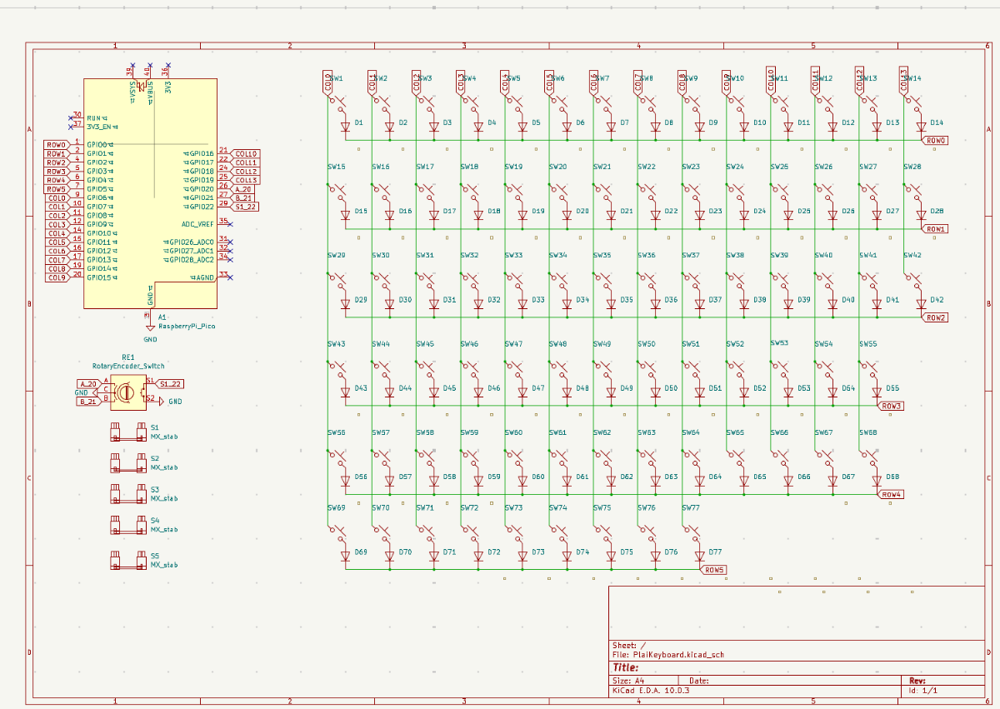
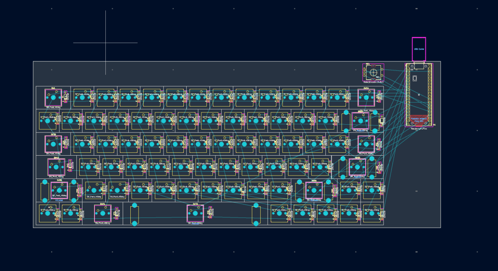

# Added Rotary Encoder

📅 **2026-08-05** · 🕐 **23:53** · ⏱️ **2h logged**  

---

I finished the schematic: I added the rotary encoder and added it . I labeled the connections wrong at first, but then when I tried again I learned how to use global net labels and it actually helped me and it was very easy to connect them. After that I  placed the footprints in the correct order and organized them. I also used a script to automatically to put the diodes in the correct spot . I then used edge cuts and cutout the board!
