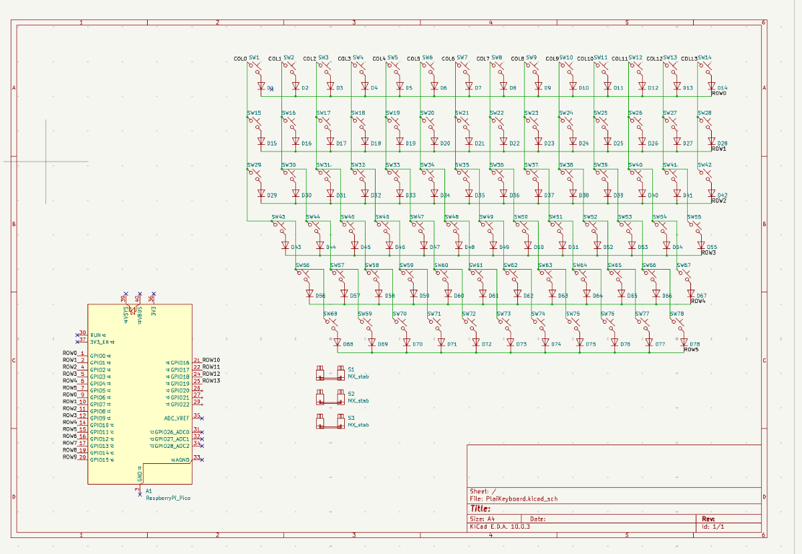
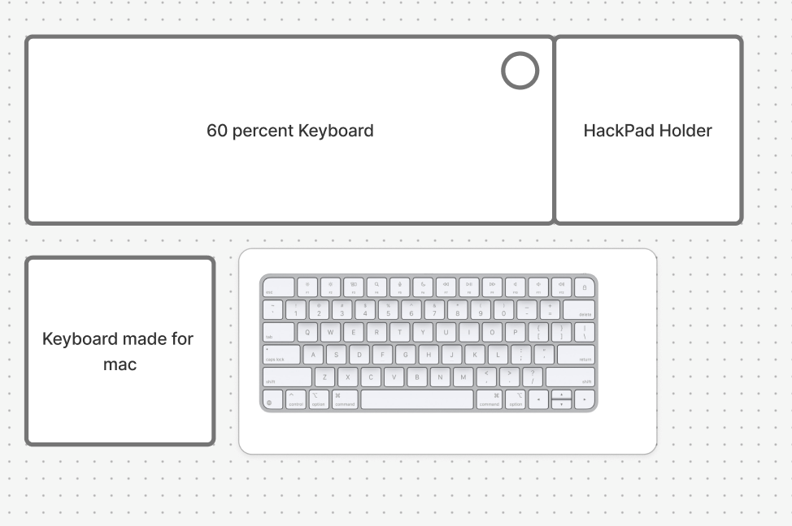

# Ideas & Schematic

📅 **2026-08-05** · 🕐 **21:28** · ⏱️ **3h logged**  

---

 
I brainstormed what should my keyboard be, and i came up with a macropad holder next to it and it should be made for a mac because That is what I have right now! I also worked on the schematics, I placed down the footprints and connected most of the connections. I am still not done I still have to add the rotary encoder.
