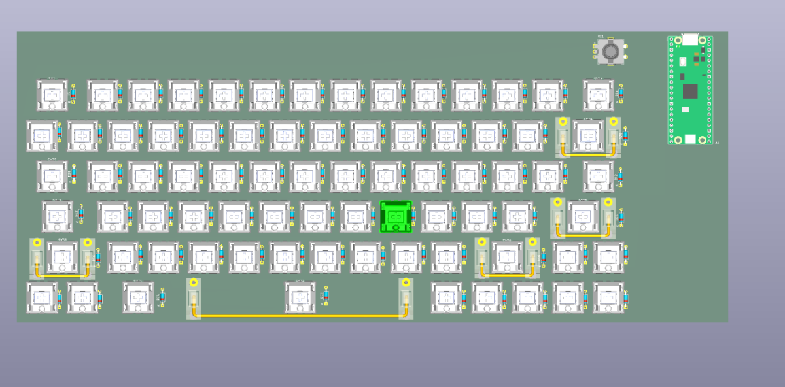
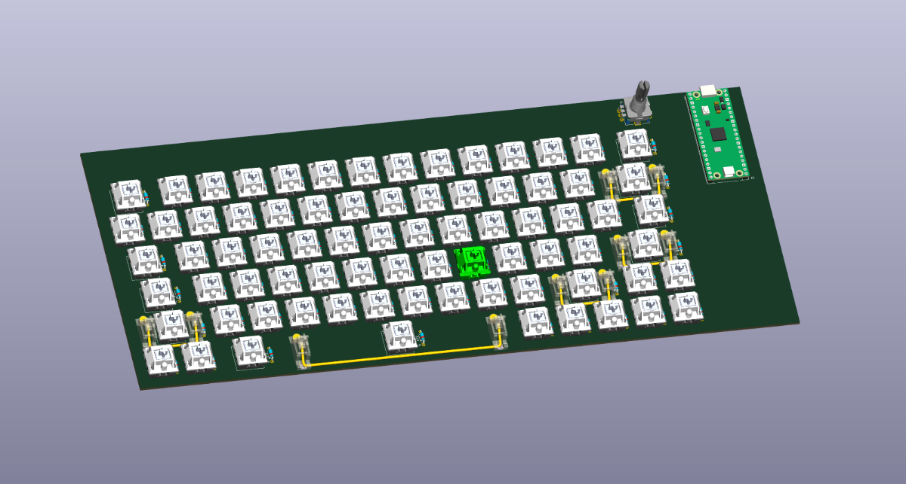
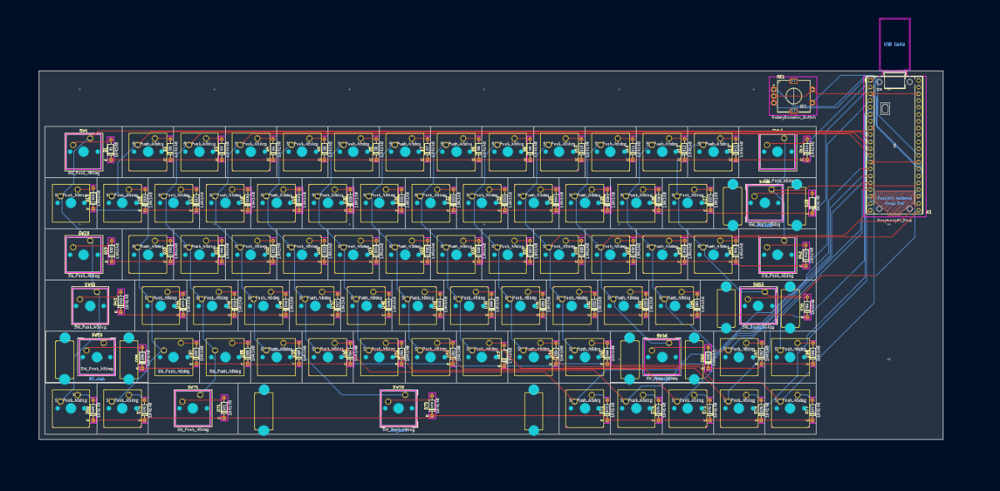

# Finished PCB

📅 **2026-08-08** · 🕐 **22:12** · ⏱️ **2h logged**  

---

I first tried and failed to put 3d models on the footprint of the switches, then I figured out that you can use python scripts in kicad. So i used gemini to help me write a script to save me time(IT SAVED ME HOURS). The script would place the correct 3d models in the correct footprint. After that I used an app called FreeRouting which auto routes your pcb and it did it perfectly. After this I am going to start using fusion 360 to make the case!

