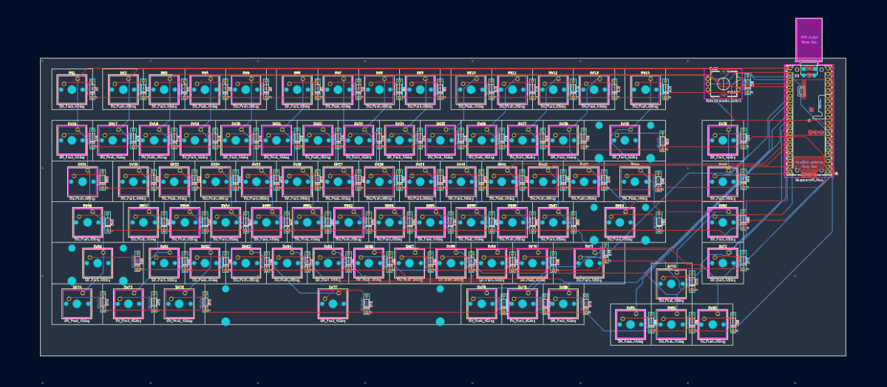
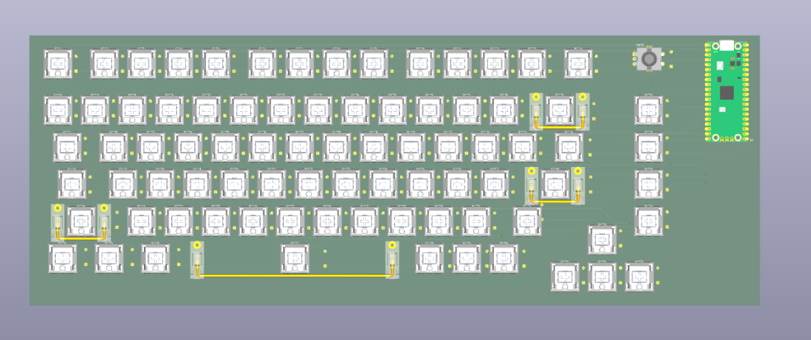
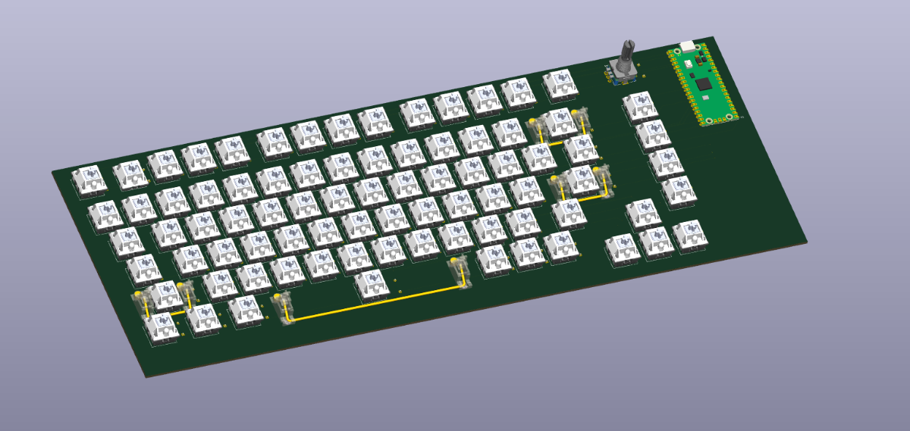

# Redid PCB

📅 **2026-08-09** · 🕐 **00:25** · ⏱️ **3h logged**  

---

I redid the whole entire Pcb because the keycaps that I wanted did not support my layout and the cheapest workaround was 50-100 dollars and I did not want my project to be reject so I redid THE WHOLE ENTIRE PCB yeah learned something lol!
