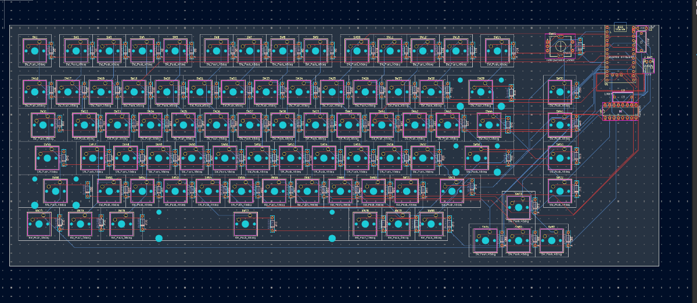
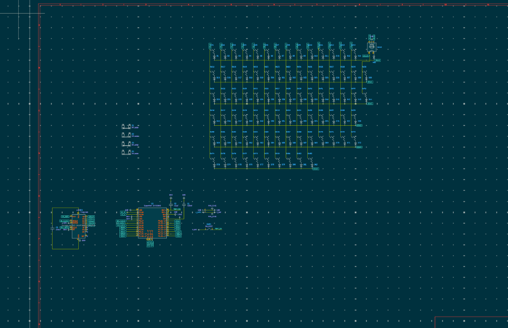

# ACTUALLY FINISHED THE PCB

📅 **2026-08-12** · 🕐 **19:41** · ⏱️ **3h logged**  

---

I finished routing the pcb. I also added 3d models and debugged the routing. This was very very time consuming and very hard but I learned that instead of having to manually change 3d models of the switches i can just update the footprints original 3d model. 

