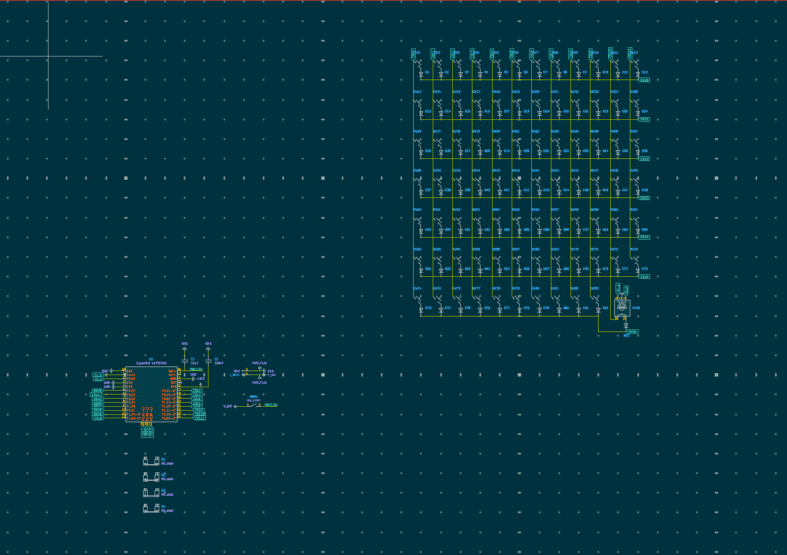

# Fixed Schematic

📅 **2026-08-15** · 🕐 **23:03** · ⏱️ **1h logged**  

---

I refactored the collumns and the rows so that they use 2 less pins which were what I needed instead of the hard to code shift register or io extender and I have more space on my keyboard too. I learned that sometimes you just need to go back the the fundementals and build that first better.
