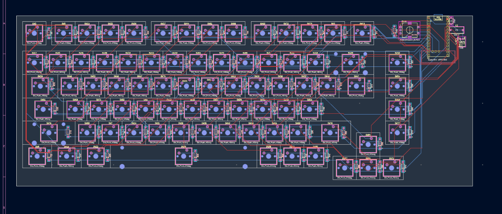
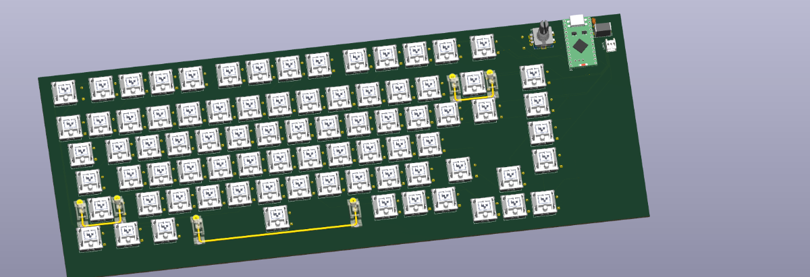

# ACTUALLY FINALLY FINISHED PCB LAST TIME

📅 **2026-08-16** · 🕐 **18:08** · ⏱️ **3h logged**  

---

Once again I was too paranoid of the pcb not working so I went back to the basic and fixed the fundemental schematic and made the matrix use less pins by transforming into it to a more square shape. After that I also routed the schematic over and over again like 3 times and landed on this one. After that I added the 3d models and am finally ready to start the CAD.
