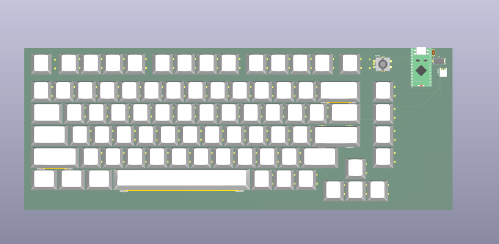

# Added keycaps to the pcb

📅 **2026-08-17** · 🕐 **19:00** · ⏱️ **2h logged**  

---

Originally I tried to add keycaps to the pcb in Fusion but when I added them it would run very very slowly so I came to kicad and added the 3d models of the keycaps here on the switches. I also didn't like how the pcb was orignally too off centered so fixed the place where it was and moved it to the top of the last collumn and first row.
