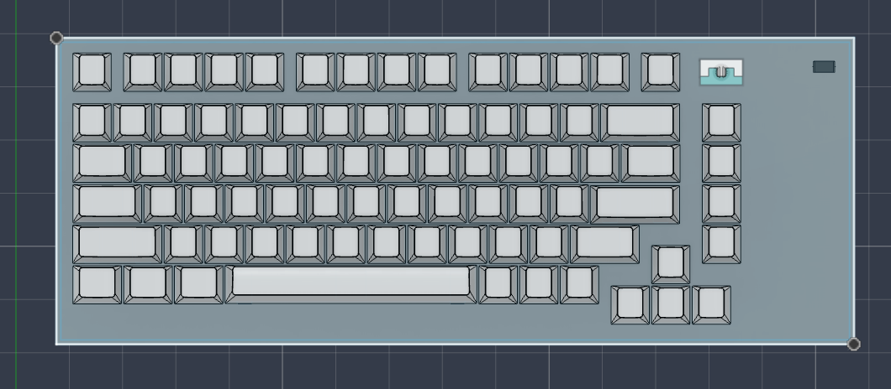

# Added some things on the cad

📅 **2026-08-21** · 🕐 **23:39** · ⏱️ **2h logged**  

---

Added the top frame and cutout them. I am going to be making a cooler design in the future. Also I added the rotary knob cap. Also I fixed some overhang that the plate had. Also I fixed this weird thing that looked weird and finished it 
