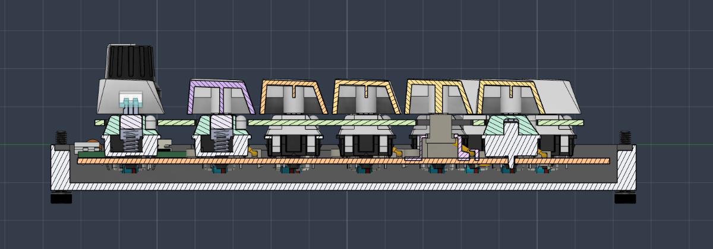
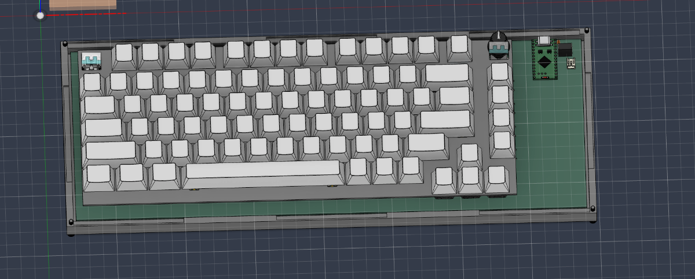

# Redid the case

📅 **2026-08-23** · 🕐 **01:02** · ⏱️ **2h logged**  

---

I redid the whole case because I forgot to add the gasket mount and I also was following the wrong guide. I added spaces for the gaskets to go to added screws and added the plate correctly. I also made it actually look better than the last. 

