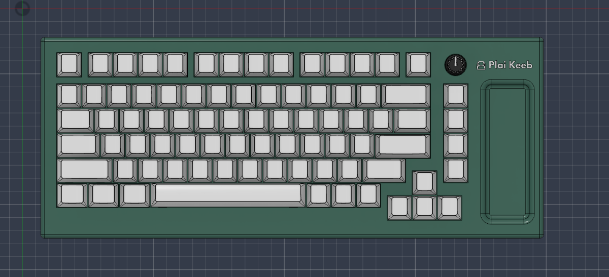

# Finished Case For Keyboard

📅 **2026-08-26** · 🕐 **21:50** · ⏱️ **3h logged**  

---

I FINALLY Finished the keyboard's case and everything. I added the screw holes and made them perfectly even and added heatset inserts. I also added a candy holder that can fit m&ms and skittles to make it a little more creative. I also colored it what I might want to make it look like.
